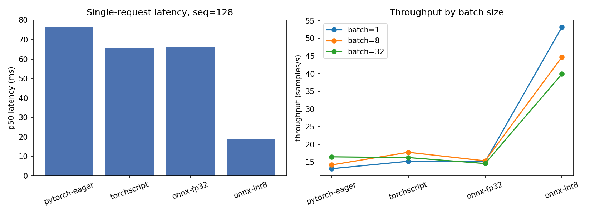

# inference-lab

How much inference latency can you actually buy with graph optimization and INT8 quantization, what
does it cost in accuracy, and does request batching help? This repo measures all three end to end,
then serves the winner.

[](https://github.com/SaiArrow/inference-lab/actions)

**Live:** https://inference-lab-694772995328.us-central1.run.app/health

```bash
curl -X POST https://inference-lab-694772995328.us-central1.run.app/predict \
  -H 'content-type: application/json' \
  -d '{"texts":["an absolute triumph","two hours I will never get back"]}'
```

Model: DistilBERT fine-tuned on SST-2. Everything below is CPU-only, single-threaded unless noted.

---

## Headline result

Quantization is the whole story. Graph optimization barely moves the needle.

| Variant | p50 (ms) | p95 (ms) | p99 (ms) | Size | SST-2 acc | Speedup |
|---|---:|---:|---:|---:|---:|---:|
| PyTorch eager | 76.3 | 89.5 | 89.8 | 256 MB | 0.911 | 1.00× |
| TorchScript | 65.7 | 66.2 | 66.9 | 256 MB | 0.911 | 1.16× |
| ONNX fp32 | 66.4 | 66.9 | 67.9 | 256 MB | 0.911 | 1.15× |
| **ONNX int8** | **18.8** | **19.0** | **19.2** | **65 MB** | **0.906** | **4.06×** |

Batch size 1, sequence length 128, 200 runs after 20 warmup, one thread.



**INT8 dynamic quantization gives a 4× speedup and a 3.9× smaller artifact for 0.46 percentage
points of accuracy.** That is close to free.

**Graph optimization on its own is worth about 16%.** TorchScript and ONNX fp32 land within 1% of
each other (65.7ms vs 66.4ms) — worth having, but not the reason to do this work. Separating the two
mattered: had I only compared eager PyTorch against quantized ONNX, I would have attributed the
entire 4× to the ONNX export.

**INT8 is also far more predictable.** Its p50-to-p99 spread is 2% (18.8 → 19.2ms). Eager PyTorch
spreads 18% (76.3 → 89.8ms). For anything with a tail-latency SLO, the tighter distribution is worth
as much as the lower median.

---

## Two results that went the wrong way

Both of these contradicted what I expected, and they turn out to be the same finding.

### Throughput *decreases* with batch size for INT8

Throughput in samples/sec, sequence length 128:

| Variant | batch=1 | batch=8 | batch=32 |
|---|---:|---:|---:|
| ONNX int8 | **53.2** | 44.7 | 39.9 |
| ONNX fp32 | 15.1 | 15.3 | 14.6 |
| TorchScript | 15.2 | 17.8 | 16.3 |
| PyTorch eager | 13.1 | 14.2 | 16.5 |

Every fp32 variant is flat or mildly improving with batch size. INT8 loses 25% of its throughput
going from batch 1 to batch 32 — the opposite of the usual assumption that batching amortizes
overhead.

The likely cause is that dynamic quantization re-quantizes activations per forward pass, and that
cost scales with batch size while the fixed per-call overhead it would otherwise amortize has
already been eliminated. With `intra_op_num_threads=1` there is no parallelism to hide it, and fixed
`max_length=128` padding means a larger batch does proportionally more work with nothing to gain.
I have not isolated this further; multi-threaded and dynamic-padding runs would be the next
experiment.

### Dynamic batching bought throughput at a bad price

The service implements request-level dynamic batching: hold incoming requests for up to
`MAX_DELAY_MS`, assemble up to `MAX_BATCH`, run one forward pass.

| | peak RPS | p50 | p95 | p99 |
|---|---:|---:|---:|---:|
| `BATCHING=0` | 61.9 | 40 ms | 190 ms | 280 ms |
| `BATCHING=1` | 73.2 | 100 ms | 400 ms | 460 ms |

**+18% throughput for 2.5× worse median latency and 2.1× worse p95.** For most latency SLOs that is
a trade you would decline.

This follows directly from the previous result. Batching only pays when larger batches are more
efficient per sample, and for this model in this configuration they are *less* efficient. The 18%
that did materialize most likely comes from queue smoothing rather than from batch efficiency.

The mechanism is implemented and instrumented (`inference_batch_size` histogram confirms batches
form), so the conclusion is about this workload rather than about the code. It would look different
with a GPU, multi-threaded ORT, or dynamic padding — all cases where per-sample cost genuinely falls
with batch size.

---

## Production behaviour

### Cloud Run

Deployed with 2 vCPU, 1 GiB, `--concurrency 4`, scale to zero.

| Configuration | peak RPS | p50 | p95 | p99 |
|---|---:|---:|---:|---:|
| 1 instance (pinned) | 13.8 | 230 ms | 540 ms | 750 ms |
| 3 instances (max) | 36.7 | 230 ms | 1400 ms | 3000 ms |

**Throughput scales 2.66× for 3× the instances** — close to linear, with the shortfall from
autoscaling lag rather than contention.

**But p99 quadruples.** Median is unchanged at 230ms while p99 goes from 750ms to 3000ms. The tail is
requests that arrive during a cold start and wait for a new instance to load the model. This is the
real cost of scale-to-zero, and it is invisible in any average.

**Cold start: 4.3s. Warm: 70ms.** A 61× difference. Two things keep the cold start that low —
`--cpu-boost`, and baking the tokenizer into the image (see below).

Local single-process peak was 61.9 RPS against Cloud Run's 13.8 for one instance. The gap is network
round-trip plus the `--concurrency 4` cap, which is deliberate: Cloud Run's default of 80 would pack
80 simultaneous requests onto 2 vCPU running a CPU-bound model, and every one of them would queue.

### Kubernetes

Manifests in `k8s/` with resource requests and limits, readiness and liveness probes, and a
CPU-target HPA. Validated on a k3d cluster under load:

```
NAME            TARGETS        MIN  MAX  REPLICAS   AGE
inference-lab   cpu: 0%/70%     2    8      2       6m14s
inference-lab   cpu: 49%/70%    2    8      2       6m30s
inference-lab   cpu: 159%/70%   2    8      2       6m45s
inference-lab   cpu: 153%/70%   2    8      5       7m
inference-lab   cpu: 91%/70%    2    8      5       7m45s
inference-lab   cpu: 80%/70%    2    8      6       8m15s
inference-lab   cpu: 67%/70%    2    8      6       9m
inference-lab   cpu: 0%/70%     2    8      6       12m
inference-lab   cpu: 0%/70%     2    8      2       13m
```

Scales 2 → 5 → 6 under load, settles at the 70% target, scales back to the floor of 2 after the
60-second stabilization window. Throughput numbers from this cluster are not comparable to the others
— traffic went through `kubectl port-forward`, which pins all connections to a single pod, on a
shared Cloud Shell VM.

---

## What broke, and what fixed it

**Cold starts failed entirely until the image became hermetic.** The service originally loaded the
tokenizer from HuggingFace at startup. On Cloud Run this returned `429 Too Many Requests` — the
egress IP is shared across GCP tenants and had already been rate-limited. Every deploy failed with a
generic "container failed to listen on PORT" message that said nothing about the real cause.

Fix: bake the tokenizer into the image, set `HF_HUB_OFFLINE=1` and `TRANSFORMERS_OFFLINE=1`, and add
a build-time assertion so a missing tokenizer fails the *build* rather than the deploy:

```dockerfile
COPY tokenizer/ tokenizer/
RUN python -c "from transformers import DistilBertTokenizerFast; \
    DistilBertTokenizerFast.from_pretrained('/app/tokenizer')"
```

A container that downloads its dependencies at startup is a container that fails when its upstream is
slow, rate-limited, or down.

**`quant_pre_process` fails on this export.** ONNX Runtime's symbolic shape inference is all-or-
nothing and raises on DistilBERT's dynamic sequence axis. Pass `auto_merge=True,
guess_output_rank=True`, or use `onnxruntime.transformers.optimizer` instead — skipping the
preprocessing entirely produces a quantized model *slower* than the one it came from.

---

## Reproducing

```bash
pip install -r requirements.txt

optimum-cli export onnx --model distilbert-base-uncased-finetuned-sst-2-english \
  --task text-classification models/onnx/
python src/export_onnx.py     # TorchScript variant
python src/quantize.py        # INT8
python src/benchmark.py       # -> results/latency.csv
python src/evaluate.py        # -> results/accuracy.csv
python src/plot_results.py
```

Serving:

```bash
docker build -t inference-lab .
docker run -p 8080:8080 inference-lab
```

Load testing (`loadtest/locustfile.py` defines a stepped load shape, so `--users` and `--run-time`
are ignored):

```bash
locust -f loadtest/locustfile.py --host http://localhost:8080 --headless --csv results/run
```

### Benchmark methodology

Three things separate this from a naive timing loop:

- **20 warmup iterations** before measurement. First-call latency includes lazy initialization and
  cache population; reporting it as steady state is the most common benchmarking error.
- **Percentiles, not means.** Production SLOs are written against p95 and p99. A mean hides the tail
  that actually pages someone.
- **Pinned thread counts** (`intra_op_num_threads=1`, `torch.set_num_threads(1)`). Without this,
  variants get different amounts of parallelism and the comparison is meaningless.

Accuracy is the full 872-example SST-2 validation split.

## Endpoints

| Route | Method | Purpose |
|---|---|---|
| `/health` | GET | Liveness and readiness |
| `/predict` | POST | `{"texts": [...]}` → labels and scores |
| `/metrics` | GET | Prometheus: request count, latency histogram, batch-size histogram |

## Stack

ONNX Runtime · PyTorch · Transformers · FastAPI · Docker · GCP Cloud Run · Cloud Build ·
Kubernetes (k3d) · Locust · Prometheus · GitHub Actions

Container targets Python 3.11.

## License

MIT